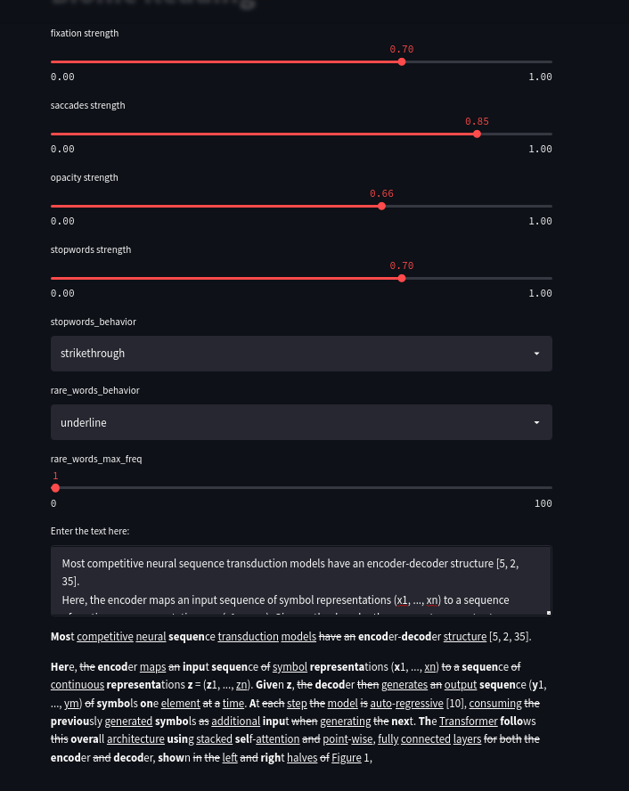

# Bionic Reading++ - Convert Text into Better Way to Read Faster
Bionic Reading is a new method facilitating the reading process by guiding the eyes through text with artificial fixation points. As a result, the reader is only focusing on the highlighted initial letters and lets the brain center complete the word.
In a digital world dominated by shallow forms of reading, Bionic Reading aims to encourage a more in-depth reading and understanding of written content.

###### This new version of BionicReading has been improved by the adding few others properties:
~~~
- remove the stopwords (very frequent word without any impact)
- highlight in a different way words that may be very important
- lot of customization on the original parameters (opacity, fixation, saccades)
~~~

### Setup instructions

```bash
git clone git@github.com:Jwuthri/BionicReading.git
cd BionicReading
virtualenv myvenv --python=python3.7  # create a new venv in 3.7
source myvenv/bin/activate  # activate venv
pip install -e .  # add project to your PYTHON_PATH
pip install -r requirements.txt  # install required packages
```

### Run streamlit server
```bash
streamlit run bionic_reading/server/streamlit_app.py
```


### Run tests
```bash
pytest --doctest-modules
```

### Run on samples
```python
from bionic_reading import BionicReading


text = """
transduction problems such as language modeling and machine translation [35, 2, 5]. Numerous
efforts have since continued to push the boundaries of recurrent language models and encoder-decoder
architectures [38, 24, 15].
Recurrent models typically factor computation along the symbol positions of the input and output
sequences. Aligning the positions to steps in computation time, they generate a sequence of hidden
states ht, as a function of the previous hidden state ht and the input for position t. This inherently
sequential nature precludes parallelization within training examples, which becomes critical at longer
sequence lengths, as memory constraints limit batching across examples. Recent work has achieved
significant improvements in computational efficiency through factorization tricks [21] and conditional
computation [32], while also improving model performance in case of the latter. The fundamental
constraint of sequential computation, however, remains.
"""
_ = BionicReading(
    fixation=0.6,
    saccades=0.75,
    opacity=0.7,
    output_format="python",
    rare_words_behavior="highlight",
    rare_words_max_freq=1,
).read_faster(text=text)
print(text)
print("*" * 20)
print(_)
```

### Properties
```bash
fixation strength between 0 - 1  # change the percentage of chars per words highlighted (the larger more characters are highlighted)
saccades strength between 0 - 1  # change how often we highlight a word (the larger more words are highlighted)
opacity strength between 0 - 1  # change the strength of the highlight (the larger the stronger is the highlight)
stopwords strength between 0 - 1  # increase the number of stopwords (the larger the more words are stopwords)
stopwords_behavior in ["strikethrough", "highlight", "remove", "ignore", "bold"]  # how we handle the stopwords
rare_words_max_freq between 0 - 100  # how often we see a word to consider it as important (the lowest the most rare is the word)
rare_words_behavior in ["highlight", "underline" ,"bold"]  # how we handle the rare words
```

### Contribute

###### Setup pre-commit hooks

    # install pre-commit on your system level
    pip install pre-commit
    
    # will install mypy and black checking
    pre-commit install

Don't hesitate to open a pr :)